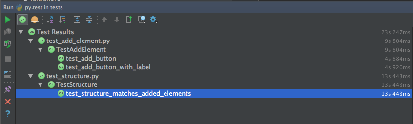

.. _getting_started:

***************
Getting started
***************

.. _requirements:

Requirements
=============================

* Python 3 `download <https://www.python.org/downloads/>`_
* pytest module `docs <http://doc.pytest.org/>`_ (see install below)
* Selenium WebDriver `docs <http://docs.seleniumhq.org/>`_ (see install below)
* Webdriver for
    - Chrome `download <https://sites.google.com/a/chromium.org/chromedriver/downloads>`_
    - Firefox `download <https://github.com/mozilla/geckodriver/releases>`_

Install pytest::

  > pip install -U pytest

Install selenium python bindings::

  > pip install -U selenium

.. _running-the-tests:

Running the tests
=============================

Go to **<project dir>/tests**

Run::

    > pytest

It will automatically discover and run all the tests and output the results::

    === test session starts ===
    platform darwin -- Python 3.5.2, pytest-3.0.3, py-1.4.31, pluggy-0.4.0
    rootdir: /Users/pavelp/Projects/huma, inifile:
    plugins: instafail-0.3.0, xdist-1.14
    collected 3 items

    tests/test_add_element.py ..
    tests/test_structure.py .

    === 3 passed in 29.89 seconds ===

Running tests in IDE
-----------------------------
Current IDEs support PyTest for running tests out of the box or via some plugin

Following report is from Intellij IDEA

